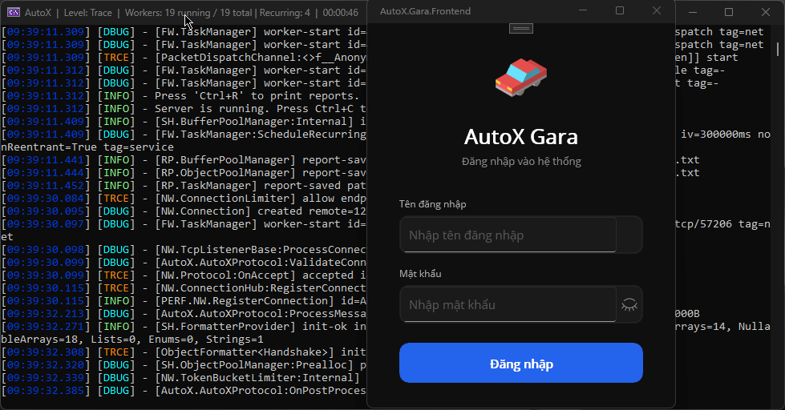
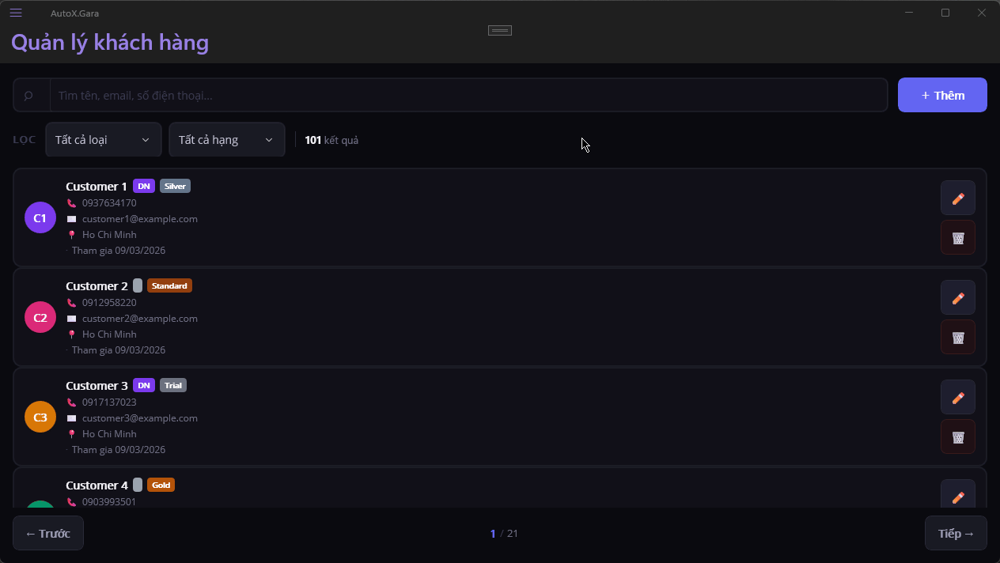
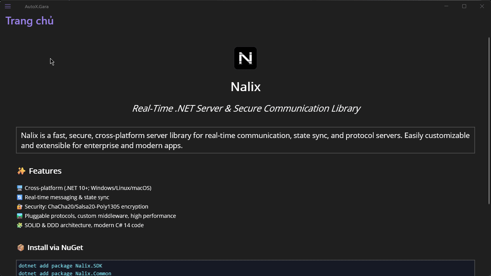
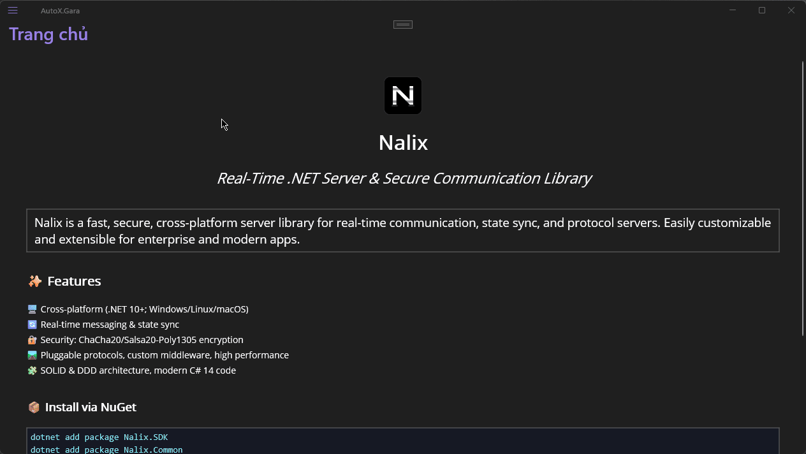
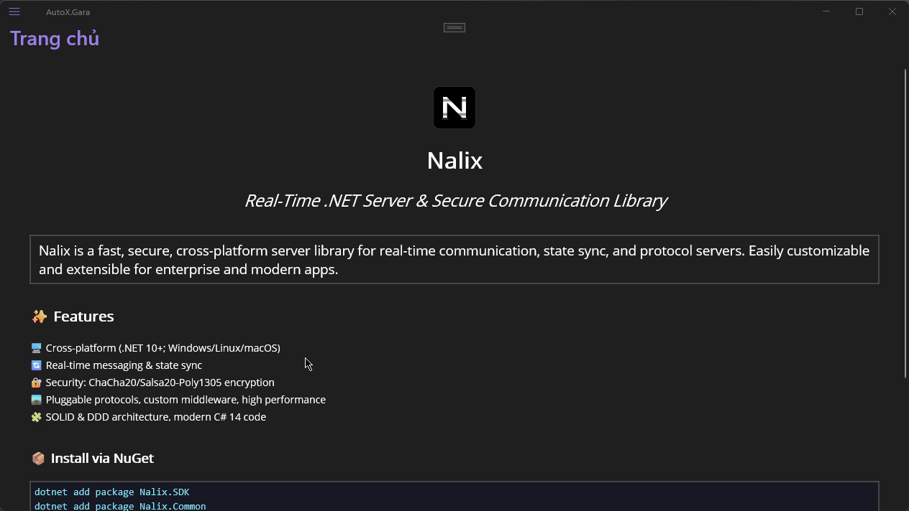

# AutoX.Gara

[](https://dotnet.microsoft.com/)
[](LICENSE)

**AutoX.Gara** là hệ thống quản lý gara ô tô dạng **Desktop Client–Server**: quản lý khách hàng, xe, kho phụ tùng, dịch vụ sửa chữa, hóa đơn và nhân viên. Ứng dụng client dùng **.NET MAUI**, server dùng **.NET** với giao tiếp **TCP** qua [Nalix.Network](https://www.nuget.org/packages/Nalix.Network).

---

## Tính năng chính

| Module | Mô tả |
|--------|--------|
| **Đăng nhập** | Xác thực tài khoản qua server, phiên làm việc an toàn |
| **Khách hàng** | CRUD khách hàng, tra cứu, lọc |
| **Nhân viên** | Quản lý hồ sơ nhân viên, lương, phân quyền |
| **Xe (Vehicles)** | Quản lý xe gắn với khách hàng |
| **Phụ tùng (Parts)** | Quản lý kho linh kiện, tồn kho |
| **Dịch vụ (Service Items)** | Danh mục dịch vụ sửa chữa / bảo dưỡng |
| **Nhà cung cấp** | Quản lý nhà cung cấp phụ tùng |
| **Sửa chữa** | Đơn sửa chữa (Repair Orders), hạng mục, công việc (Repair Tasks) |
| **Hóa đơn & Giao dịch** | Hóa đơn, giao dịch thanh toán |

---

## Yêu cầu hệ thống

- **.NET 10 SDK**
- **Windows** (client MAUI Windows, server console)
- **SQLite** (mặc định) hoặc **PostgreSQL** (tùy chọn, cấu hình server)

---

## Cấu trúc solution

```log
src/
├── AutoX.Gara.sln
├── AutoX.Gara.Domain/        # Entity, value object (DDD)
├── AutoX.Gara.Application/   # Use case, command/query (Nalix message handlers)
├── AutoX.Gara.Infrastructure/# DbContext, Repository, Nalix listener/protocol
├── AutoX.Gara.Shared/        # DTO, protocol (request/response), config
├── AutoX.Gara.Backend/       # Server (console host, TCP listener)
└── AutoX.Gara.Frontend/      # Client MAUI (Windows)
```

Chi tiết kiến trúc: [ARCHITECTURE.md](ARCHITECTURE.md).

---

## Build & chạy

### 1. Clone & restore

```bash
git clone https://github.com/ppn-systems/AutoX.Gara.git
cd AutoX.Gara/src
dotnet restore
```

### 2. Chạy server (Backend)

```bash
cd src/AutoX.Gara.Backend
dotnet run
```

Server mặc định lắng nghe TCP (port/cấu hình theo Nalix). Database mặc định: **SQLite** (file `AutoX.db` trong thư mục dữ liệu của ứng dụng).

### 3. Chạy client (Frontend – Windows)

```bash
cd src/AutoX.Gara.Frontend
dotnet build -f net10.0-windows10.0.19041.0
dotnet run -f net10.0-windows10.0.19041.0
```

Hoặc mở solution trong Visual Studio và chọn **AutoX.Gara.Frontend** làm startup project (target Windows).

### 4. Database & migrations

- **SQLite**: file DB được tạo tự động (hoặc qua migration).
- **PostgreSQL**: cấu hình `DatabaseType = "PostgreSQL"` và `ConnectionString` trong cấu hình server.

Tạo/cập nhật schema bằng EF Core:

```bash
cd src/AutoX.Gara.Infrastructure
dotnet ef migrations add YourMigrationName --startup-project ../AutoX.Gara.Backend
dotnet ef database update --startup-project ../AutoX.Gara.Backend
```

Hướng dẫn chi tiết: [docs/GETTING_STARTED.md](docs/GETTING_STARTED.md).

---

## Preview giao diện

### Đăng nhập (Login)

> Trải nghiệm hệ thống xác thực nhanh, bảo mật.



---

### Quản lý khách hàng (Customer Management)

> Giao diện quản lý khách hàng chuyên nghiệp, dễ sử dụng.



---

### Quản lý nhân viên (Employee Management)

> Theo dõi, phân quyền và cập nhật hồ sơ nhân viên.



---

### Quản lý linh kiện/phụ tùng (Parts Management)

> Kiểm soát kho phụ tùng – cập nhật trạng thái, số lượng, tra cứu dễ dàng.


---

### Quản lý dịch vụ (Service Management)

> Tạo mới, quản lý các dịch vụ sửa chữa, bảo dưỡng.



---

### Quản lý nhà cung cấp (Supplier Management)

> Quản lý thông tin, theo dõi lịch sử nhập hàng từ các nhà cung cấp.



---

---

## Công nghệ sử dụng

| Thành phần | Công nghệ |
|------------|-----------|
| Client UI | .NET MAUI 10 (Windows) |
| Server | .NET 10 (Console) |
| Giao tiếp | TCP, Nalix.Network (message framing, serialization) |
| Database | SQLite (mặc định), PostgreSQL (tùy chọn) |
| ORM | Entity Framework Core 10 |
| Logging | Nalix.Logging |
| Client MVVM | CommunityToolkit.Mvvm |

---

## Tài liệu thêm

- [ARCHITECTURE.md](ARCHITECTURE.md) — Kiến trúc hệ thống, lớp, luồng dữ liệu
- [docs/GETTING_STARTED.md](docs/GETTING_STARTED.md) — Hướng dẫn bắt đầu nhanh
- [CONTRIBUTING.md](CONTRIBUTING.md) — Đóng góp code / báo lỗi
- [CHANGELOG.md](CHANGELOG.md) — Lịch sử thay đổi
- [SECURITY.md](SECURITY.md) — Báo lỗi bảo mật

---

## License

Dự án được phát hành theo giấy phép **Apache-2.0**. Xem [LICENSE](LICENSE).

---

## Tác giả / Tổ chức

**PPN Corporation**

Nếu bạn sử dụng hoặc tham gia đóng góp dự án, vui lòng tuân thủ [CODE_OF_CONDUCT.md](CODE_OF_CONDUCT.md).
